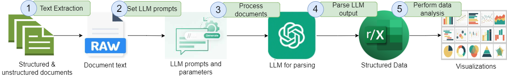

# LLM-Powered-Document-Parsing-and-Analysis
The code in this notebook extracts key information from semi-structured and unstructued documents using an LLM and subsequently analyzes this information. The following figure shows the entire workflow of document parsing with LLM and subsequent analysis.  

  

Install the following libraries for this code.  
```python
!pip install tqdm  # For displaying a progress bar for document processing  
!pip install requests  # For making HTTP requests  
!pip install pandas  # For data manipulation and analysis  
!pip install python-docx  # For processing Word documents  
!pip install plotly  # For creating interactive visualizations  
!pip install numpy  # For numerical computations  
!pip install scikit-learn  # For machine learning algorithms and tools  
!pip install matplotlib  # For creating static, animated, and interactive plots  
!pip install openai  # For interacting with the OpenAI API  
!pip install seaborn  # For statistical data visualization

#How code works
The code in the first cell of the notebook extracts text from the WORD documents and send each document to gpt-4o-mini via successive API calls. The model returns the output in a JSON object which is further parsed and noramlized and finally saved in an Excel file.

 

